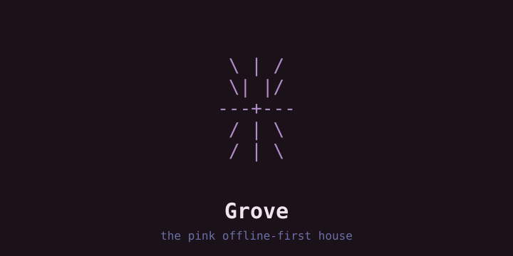

# Grove — the pink offline-first house

Static front door for the whole column: fire → glass → house → suite.
Opens at the splash, drops you at the fire, climb by scrolling up.

## Serve

Any static server (or straight from disk until the domain lands):

```bash
cd ~/grove && python3 -m http.server 8000
```

No build, no JS framework, no telemetry. Palette: `fae-kernel/docs/identity/IDENTITY.md`.

## License

MIT — see [LICENSE](LICENSE). Screenshots are our own machines.
